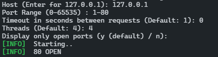

# go-basic-port-scanner
 Scanning of TCP ports only.

 Usage

 ```
    git clone https://github.com/KadirFiratFTW/go-basic-port-scanner
    cd ./go-basic-port-scanner
    go install
    go run main.go
 ```

 Build

 ```
    git clone https://github.com/KadirFiratFTW/go-basic-port-scanner
    cd ./go-basic-port-scanner
    go build
    ./BasicPortScanner or ./BasicPortScanner.exe
 ```

